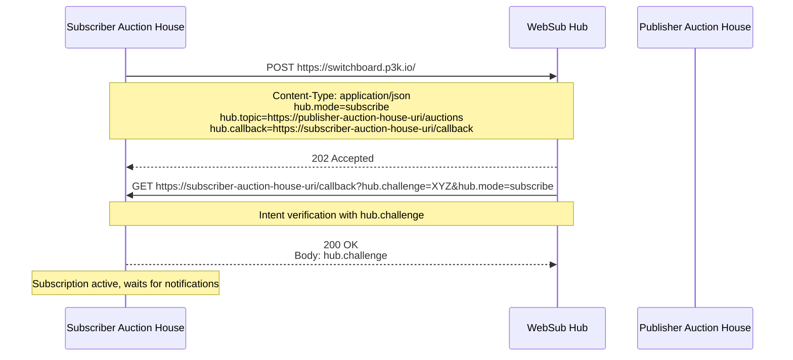
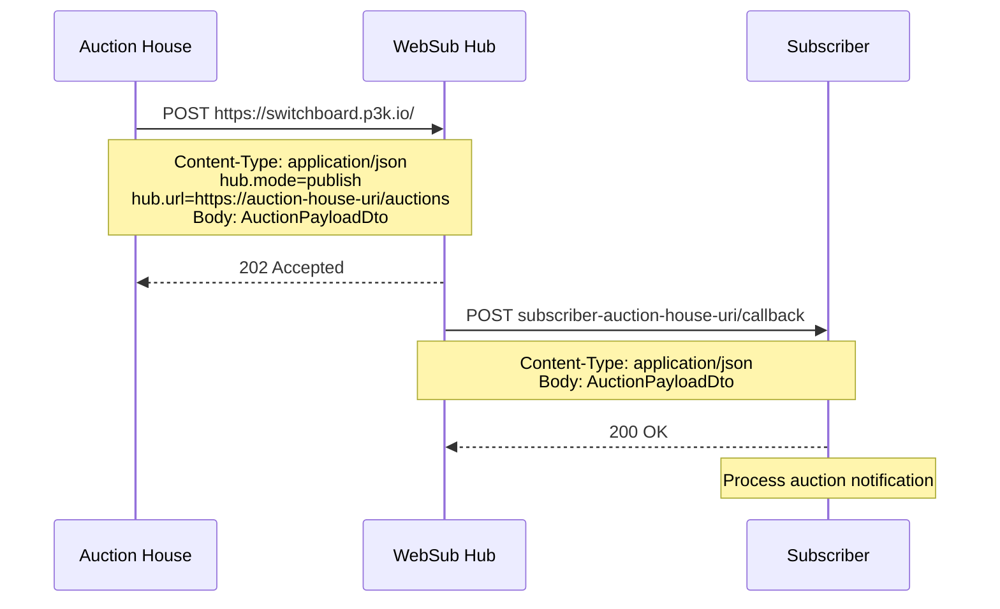
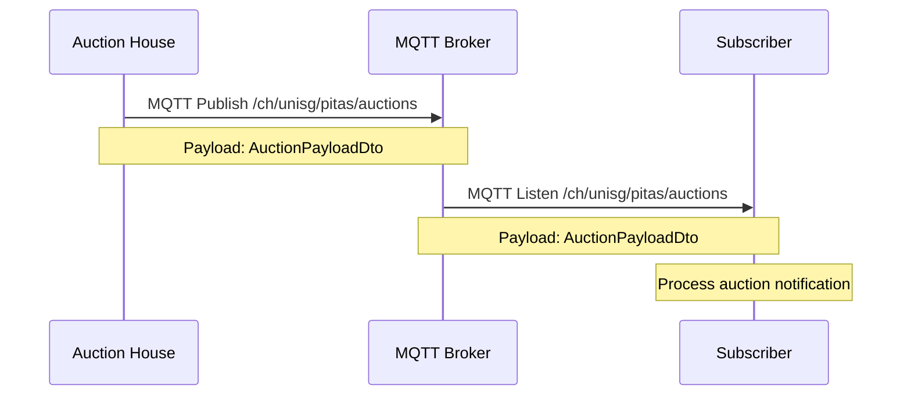

# PITAS HS25 Auction API Specification

This repository contains the API specification used for the PITAS auction house.

The OpenAPI document is automatically rendered to GitHub Pages.

## API Versioning

The used API version is passed with each request as the header `X-API-Version`. If the implementation does not support the version, HTTP error `400` shall be returned

## Interactions

### WebSub Subscribe to Another Auction House



### WebSub Publish New Auction

Each auction house must subscribe to the other auction houses, retrieve the list either via the provided RegistryService or the custom discovery method.



### MQTT Publish New Auction

We use the public broker hive.mq, with the topic `/ch/unisg/pitas/auctions`. All groups publish and listen on the same topic.



## Shared Job Type

In order to allow groups to test the system easily, a shared job type is defined which every group shall implement.

| jobType   | inputData | outputData          |
| --------- | --------- | ------------------- |
| `testJob` | string    | `Testing: {string}` |

### Example

#### Request

```
{
    "jobType": "testJob",
    "inputData": "abcde"
}
```

#### Reply

```
{
    "outputData": "Testing: abcde"
}
```
