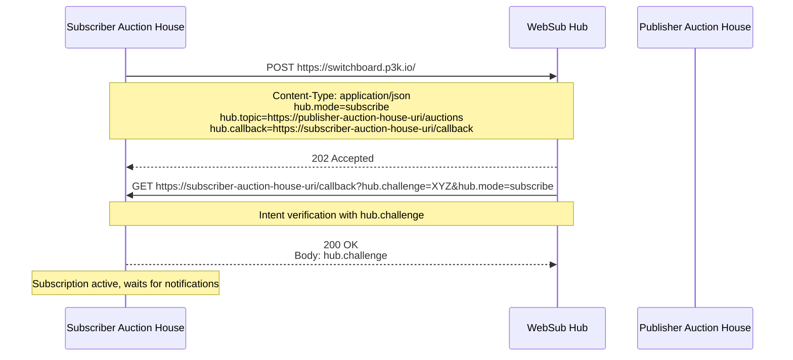
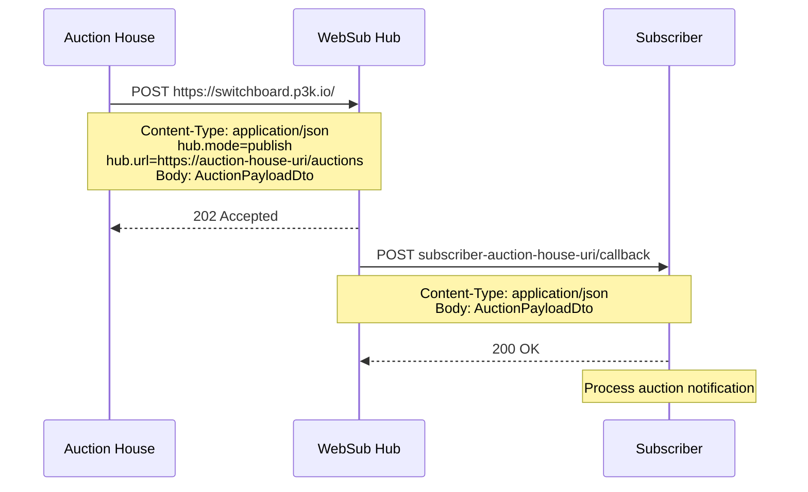
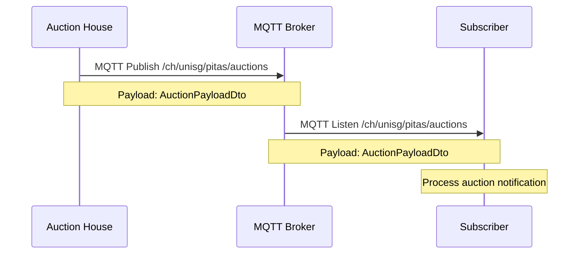

# PITAS HS25 Auction API Specification

This repository contains the API specification used for the PITAS auction house.

The OpenAPI document is automatically rendered to GitHub Pages.

## API Versioning

The API version is specified in the request and response payloads using a `version` field. Clients should include the `version` field in their requests, and servers should respond with the corresponding `version` field. If the implementation does not support the requested version, an HTTP error `400` shall be returned.

## Interactions

### WebSub Subscribe to Another Auction House



### WebSub Publish New Auction

Each auction house must subscribe to the other auction houses, retrieve the list either via the provided RegistryService or the custom discovery method.



### MQTT Publish New Auction

We use the public broker hive.mq, with the topic `/ch/unisg/pitas/auctions`. All groups publish and listen on the same topic.



## Shared Job Type

In order to allow groups to test the system easily, a shared job type is defined which every group shall implement.

| jobType   | inputData | outputData          |
| --------- | --------- | ------------------- |
| `testJob` | string    | `Testing: {string}` |

### Example

#### Request

```
{
    "jobType": "testJob",
    "inputData": "abcde"
}
```

#### Reply

```
{
    "outputData": "Testing: abcde"
}
```

## Hypermedia Links Implementation

**In short**:

- Every group has the following group as entry node (eg. group1 -> group2 -> ... -> groupN -> group1)
- Each group exposes the `/discovery` endpoint which returns a list of all known nodes. Including their own node as well. See [API Spec](auction-house.yaml) for details.
- Each group is responsible to proactively maintain the list of nodes and not compute it on request.

**Assumptions**:

- Nodes stay online forever (e.g. they do not disappear). It's the responsibility of each group if they want to check if a node is still online.

**Available Relations**:

- `relation`: Indicates a generic link between resources in the hypermedia API. This relation can be used to express connections or associations between nodes or entities, where a more specific relation type is not applicable.


## Hypermedia Links (Exercise 9)

### Overview

- Each group links to **exactly ONE** other group (ring topology)
- Two separate rings: `ODD` (groups 1,3,5,7,...) and `EVEN` (groups 2,4,6,8,...)
- Each group exposes `/discovery` to list known nodes of the same type
- Use `rel="relation"` with `type` hint in Link headers

### Ring Topology

```
ODD Ring:  Group1 → Group3 → Group5 → Group7 → Group1
EVEN Ring: Group2 → Group4 → Group6 → Group8 → Group2
```

### Application Types

| Type   | Groups          |
|--------|-----------------|
| `ODD`  | 1, 3, 5, 7, ... |
| `EVEN` | 2, 4, 6, 8, ... |

---

## Required Endpoints

### GET /auctions/

Returns open auctions with hypermedia Link headers.

**Response Headers:**
```http
Link: <https://websub.appspot.com/>; rel="hub"
Link: <https://my-auction-house.com/auctions/>; rel="self"
Link: <https://next-group.com/auctions/>; rel="relation"; type="ODD"
X-Application-Area: ODD
```

### GET /discovery

Returns known nodes of the same application type.

**Response:**
```json
{
  "version": 1,
  "data": {
    "type": "ODD",
    "hosts": [
      { "auctionHouseUri": "https://group1.example.com/" },
      { "auctionHouseUri": "https://group3.example.com/" }
    ]
  }
}
```

### POST /discovery

Registers a new auction house (same type only).

**Request:**
```json
{
  "version": 1,
  "data": {
    "type": "ODD",
    "auctionHouseUri": "https://new-group.example.com/"
  }
}
```

**Success:** `201 Created`
**Type Mismatch:** `400 Bad Request`

---

## Implementation Checklist

- [ ] `GET /auctions/` returns `Link: rel="relation"; type="ODD|EVEN"` pointing to next group
- [ ] `GET /auctions/` returns `X-Application-Area` header
- [ ] `GET /discovery` returns list of known nodes (same type)
- [ ] `POST /discovery` accepts registrations (same type only)
- [ ] Proactively maintain node list (crawl on startup/periodically)

---

## Group Configuration

| Group | Type | Next Group |
|-------|------|------------|
| 1     | ODD  | 3          |
| 2     | EVEN | 4          |
| 3     | ODD  | 5          |
| 4     | EVEN | 6          |
| 5     | ODD  | 7          |
| 6     | EVEN | 8          |
| 7     | ODD  | 1          |
| 8     | EVEN | 2          |

