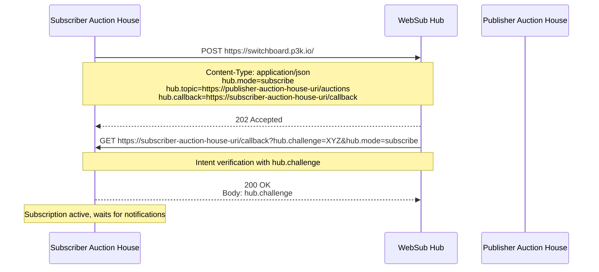
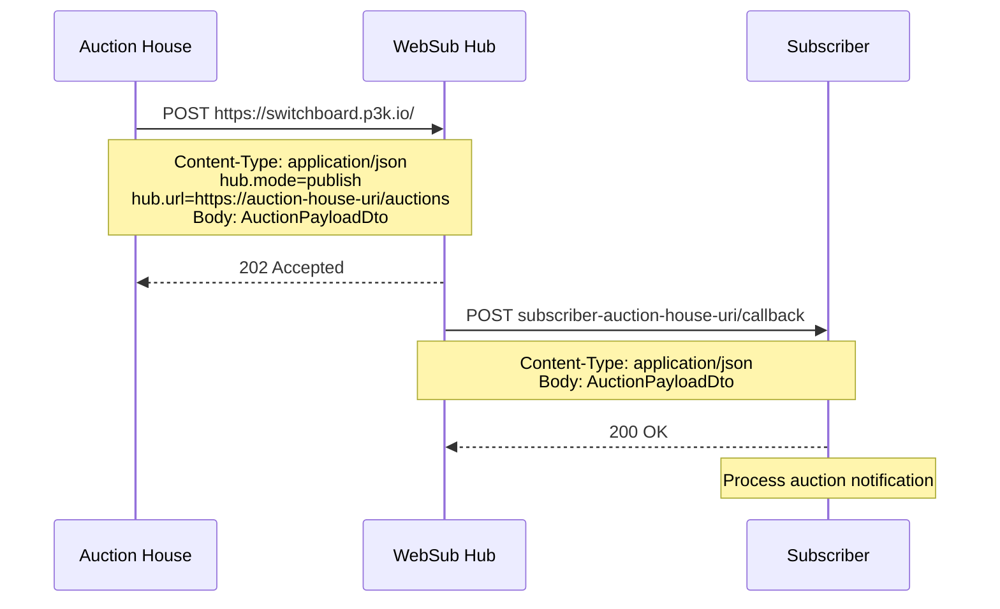
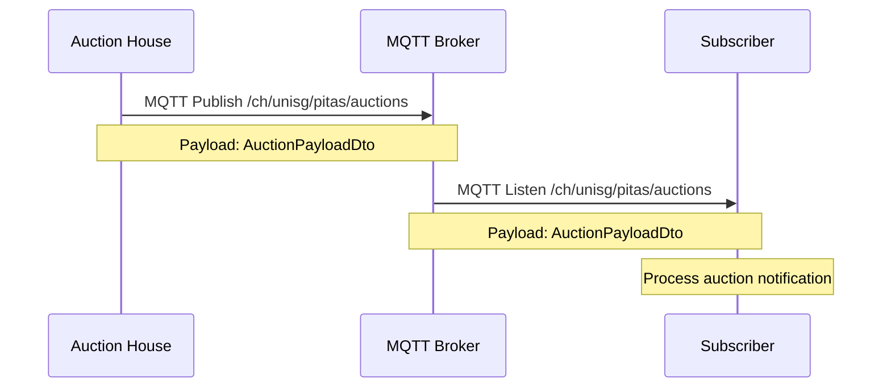

# PITAS HS25 Auction API Specification

This repository contains the API specification used for the PITAS auction house.

The OpenAPI document is automatically rendered to GitHub Pages.

## API Versioning

The API version is specified in the request and response payloads using a `version` field. Clients should include the `version` field in their requests, and servers should respond with the corresponding `version` field. If the implementation does not support the requested version, an HTTP error `400` shall be returned.

## Interactions

### WebSub Subscribe to Another Auction House



### WebSub Publish New Auction

Each auction house must subscribe to the other auction houses, retrieve the list either via the provided RegistryService or the custom discovery method.



### MQTT Publish New Auction

We use the public broker hive.mq, with the topic `/ch/unisg/pitas/auctions`. All groups publish and listen on the same topic.



## Shared Job Type

In order to allow groups to test the system easily, a shared job type is defined which every group shall implement.

| jobType   | inputData | outputData          |
| --------- | --------- | ------------------- |
| `testJob` | string    | `Testing: {string}` |

### Example

#### Request

```
{
    "jobType": "testJob",
    "inputData": "abcde"
}
```

#### Reply

```
{
    "outputData": "Testing: abcde"
}
```

## Hypermedia Links Implementation

**In short**:

- Every group has the following group as entry node (eg. group1 -> group2 -> ... -> groupN -> group1)
- Each group exposes the `/discovery` endpoint which returns a list of all known nodes. Including their own node as well. See [API Spec](auction-house.yaml) for details.
- Each group is responsible to proactively maintain the list of nodes and not compute it on request.

**Assumptions**:

- Nodes stay online forever (e.g. they do not disappear). It's the responsibility of each group if they want to check if a node is still online.

**Available Relations**:

- `relation`: Indicates a generic link between resources in the hypermedia API. This relation can be used to express connections or associations between nodes or entities, where a more specific relation type is not applicable.

## Test Client

The `auction-test-client` is a lightweight test service that automatically interacts with the auction house API for testing purposes.

### Deployment

See [DOCKER_README.md](auction-test-client/DOCKER_README.md) for Docker-based deployment and usage instructions.
